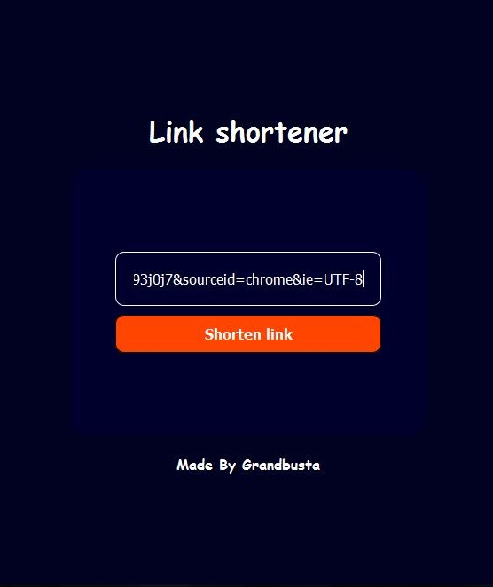
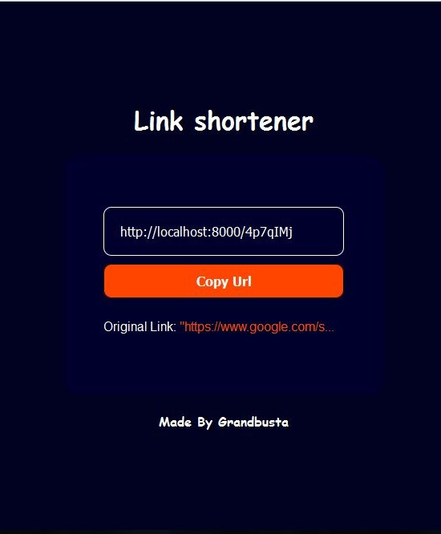

# Link Shortener
A link shortener made with Node JS.

## ✨ Features
- [x] Shorten links.
- [x] Unique short links.
- [x] Easily copy Short links.

# Screenshots
  

# 🔌Requirements
-Node JS installed on windows, mac or linux.
-Little knowledge of Node.
-Mysql installed.
-Editor(VS code, Atom e.t.c.)

🤓Follow me on twitter @iamgrandbusta
